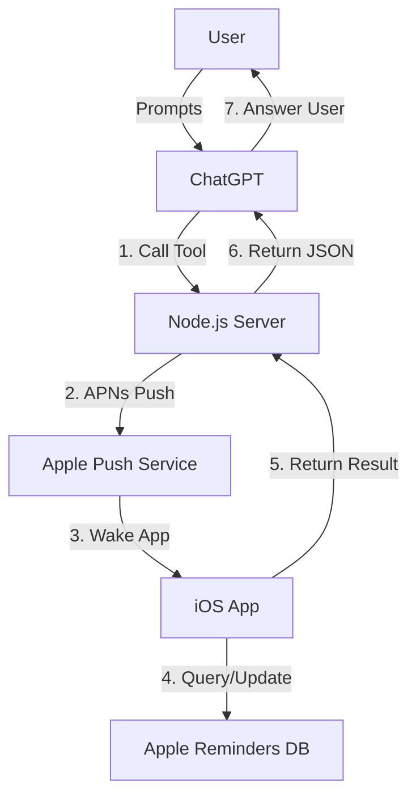
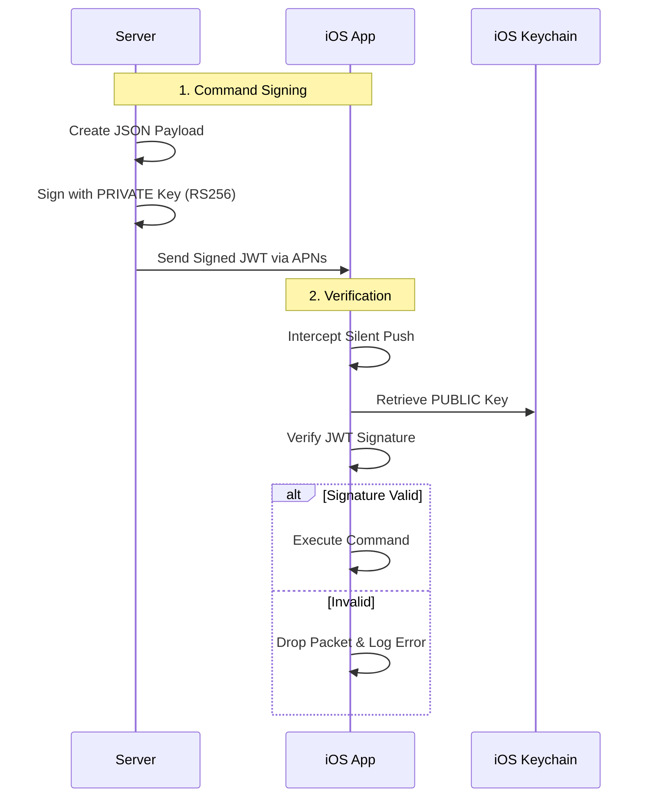

# GPT Reminders Bridge

A secure bridge connecting ChatGPT to Apple Reminders via a personal iOS app.

## Architecture



## Directory Structure

- **[`server/`](server/README.md)**: Node.js backend that signs commands and handles APNs.
- **[`ios-app/`](ios-app/README.md)**: Swift iOS app that executes commands on the device.
- **[`scripts/`](scripts/README.md)**: Testing and utility scripts.

## Quick Start

1.  **Server Setup**:
    ```bash
    cd server
    npm install
    npm run gen-keys
    npm run dev
    ```
2.  **iOS Setup**:
    - Open `ios-app/GPTReminders.xcodeproj`
    - Add `server/keys/public.pem` to the app bundle.
    - Run on a physical device (Simulators don't support APNs).

## Security Model


