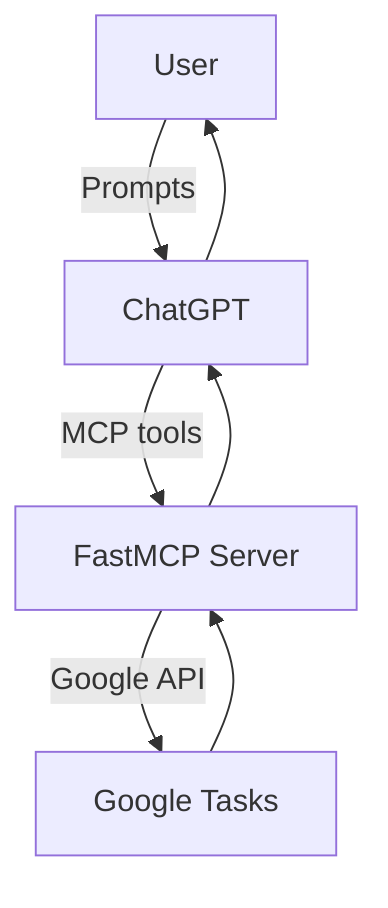

# Google Tasks MCP

A FastMCP server that exposes Google Tasks as tools. No iOS app, no APNs — the server talks directly to Google Tasks via OAuth.

## Architecture



## Tool surface
- `list_task_lists` — list available task lists
- `list_tasks` — list tasks (filter by status)
- `create_task` — create a task
- `update_task` — update a task
- `complete_task` — mark a task as completed
- `delete_task` — delete a task

Task shape returned:
- `id`, `title`, `notes`, `status` (`needsAction` or `completed`), `dueISO`, `completedISO`, `listId`, `url`

## Setup

1) Enable Google Tasks API and create OAuth client (Desktop app)  
   - Download `credentials.json` to the repo root.

2) Install deps (uses uv):
```bash
uv sync
```

3) Create `token.json` (one-time OAuth consent):  
   Run a short script (for example):
```bash
uv run python - <<'PY'
from pathlib import Path
from google_auth_oauthlib.flow import InstalledAppFlow

creds_path = Path("credentials.json")
flow = InstalledAppFlow.from_client_secrets_file(
    creds_path,
    scopes=["https://www.googleapis.com/auth/tasks"],
)
creds = flow.run_local_server(port=0)
Path("token.json").write_text(creds.to_json())
print("token.json written")
PY
```
Keep `token.json` private and out of version control.

4) Run the MCP server:
```bash
uv run python server.py
# SSE endpoint: http://0.0.0.0:8000/sse/
```

## Configuration
- `credentials.json` — Google OAuth client (installed app)
- `token.json` — stored access/refresh token
- Optional `.env` for overrides:
  - `CREDENTIALS_PATH`
  - `TOKEN_PATH`
  - `DEFAULT_TASKLIST_ID` (defaults to `@default`)

## Notes
- This replaces the previous Apple Reminders + iOS bridge. Legacy `server/` and `ios-app/` directories are no longer used.