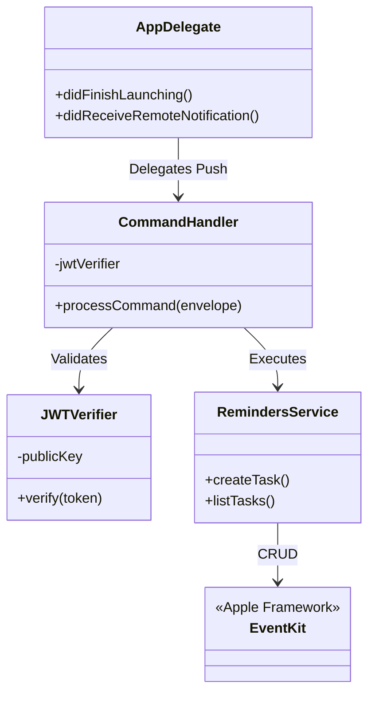
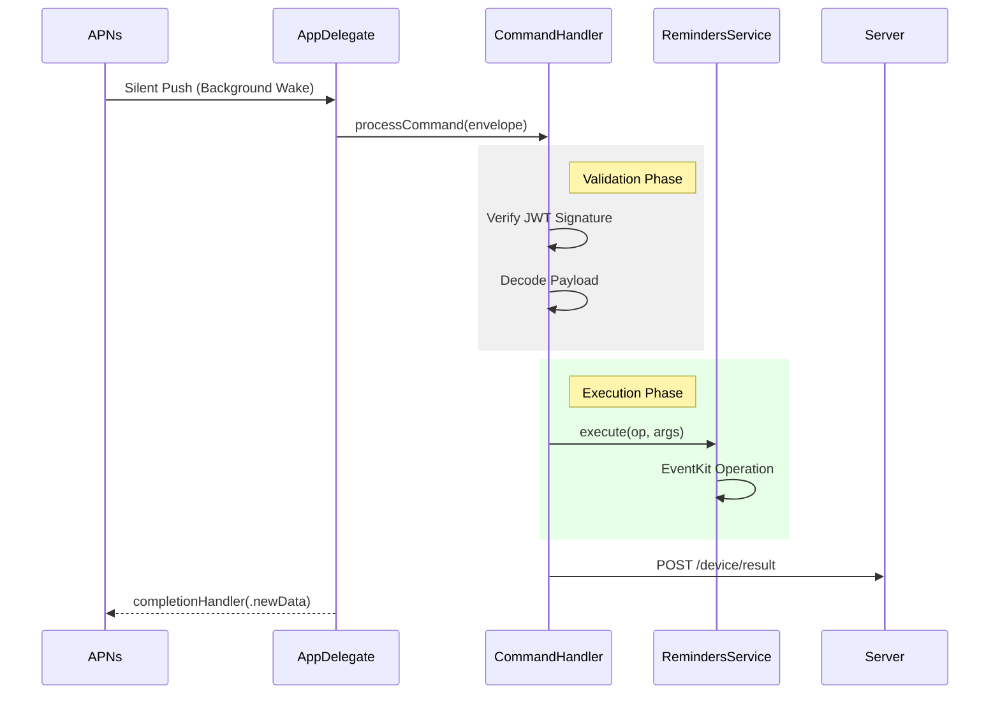

# GPT Reminders iOS App

Native Swift application acting as a background worker node.

## App Architecture

## Execution Sequence

## Dependencies

- **EventKit**: Access to Apple Reminders database.
- **UserNotifications**: Handling silent push triggers.
- **Security**: Crypto logic for RS256 verification.

## Configuration

Ensure `public.pem` generated by the server is added to the Xcode project bundle.
