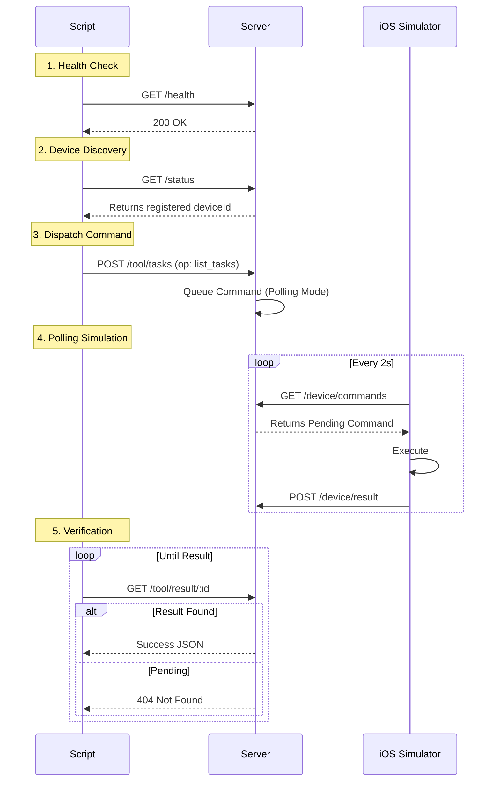

# Scripts & Tests

Utility scripts for iOS app setup, testing, and end-to-end verification.

## iOS Setup Scripts

### `add-public-key-to-xcode.js`

Adds `public.pem` to the Xcode project bundle.

```bash
node scripts/add-public-key-to-xcode.js
```

### `configure-server-url.js`

Updates the server URL in `AppDelegate.swift`.

```bash
# Default: localhost:3000
node scripts/configure-server-url.js

# Custom URL
node scripts/configure-server-url.js "http://192.168.1.100:3000"
```

### `configure-bundle-id.js`

Updates the bundle identifier in the Xcode project.

```bash
node scripts/configure-bundle-id.js com.yourname.GPTReminders
```

### `build-and-run.sh`

Builds and runs the iOS app on simulator or device.

```bash
# Simulator (default: iPhone 15 Pro)
./scripts/build-and-run.sh simulator

# Specific simulator
./scripts/build-and-run.sh simulator "iPhone 14"

# Device (opens Xcode for signing)
./scripts/build-and-run.sh device
```

## Integration Test Flow

`test-integration.sh` validates the full loop without GPT.



## Usage

```bash
# Run full integration test (requires running server + simulator)
./test-integration.sh
```
