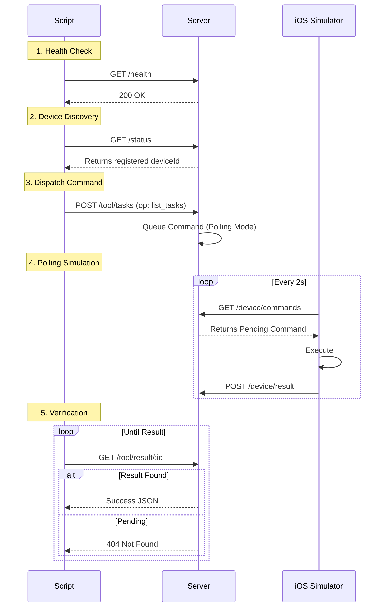

# Scripts & Tests

Utility scripts for testing and end-to-end verification.

## Integration Test Flow

`test-integration.sh` validates the full loop without GPT.



## Usage

```bash
# Run full integration test (requires running server + simulator)
./test-integration.sh
```
