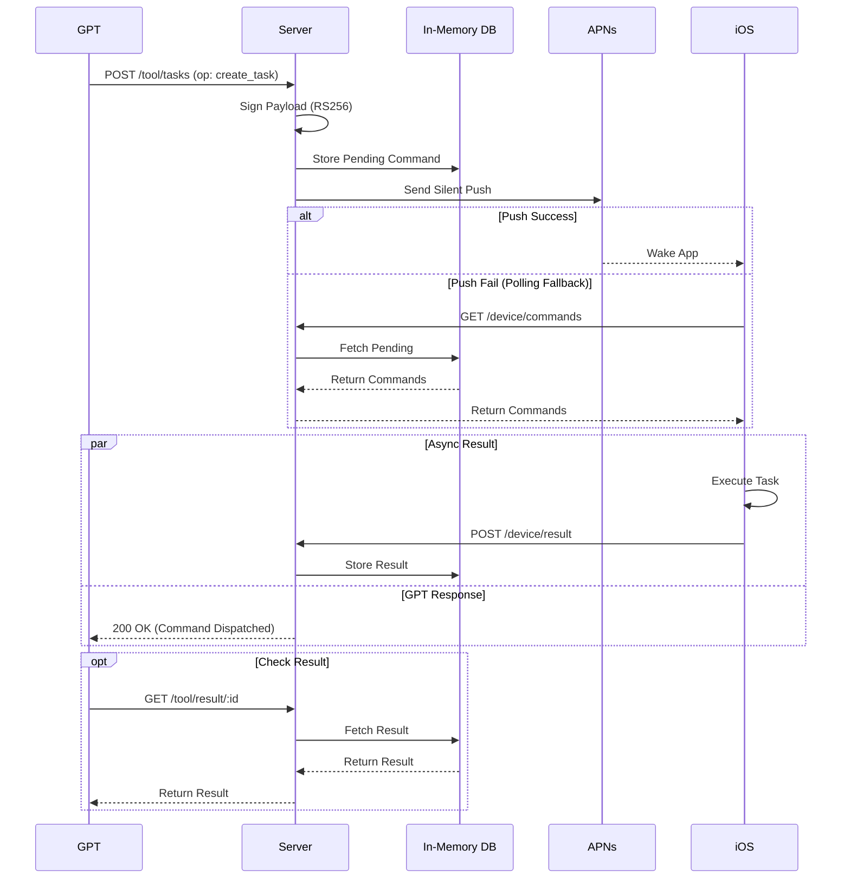
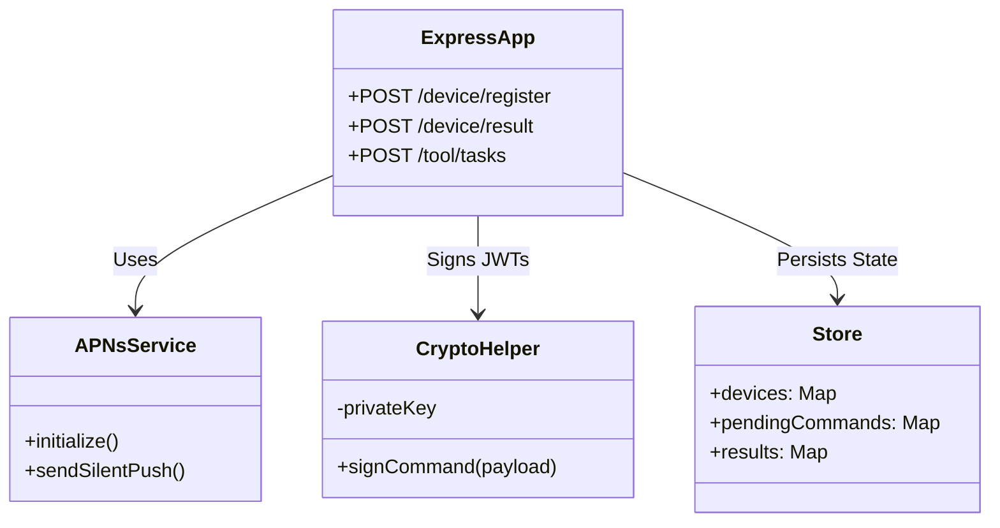
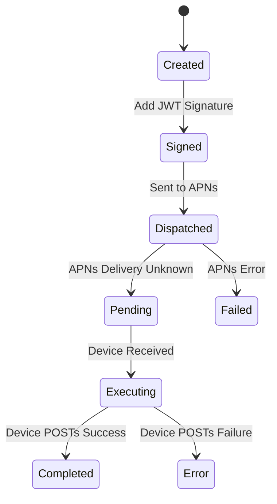

# Tasks Proxy Server

Node.js server acting as the secure gateway between GPT and the iOS device.

## Command Flow

## Component Architecture

## State Machine (Command Lifecycle)

## Setup

1.  **Install**: `npm install`
2.  **Keys**: `npm run gen-keys`
3.  **Env**: Copy `env.example` to `.env` and configure APNs keys.
4.  **Run**: `npm run dev`
